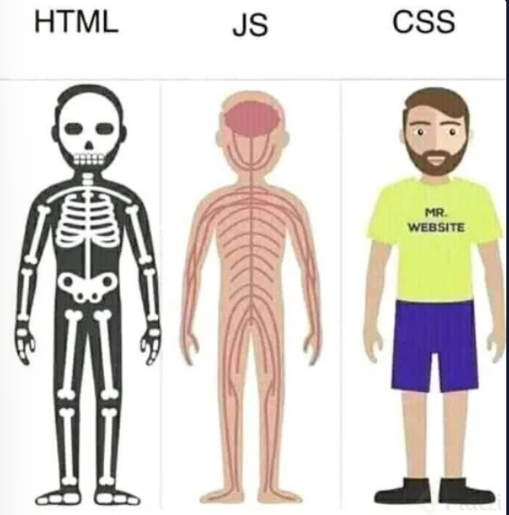

# HTML y CSS
Existen tres estándares importantes para crear o desarrollar proyectos web:
* HTML
* CSS
* JavaScript

## HTML
Es la estructura de los documentos que se visualizan en los navegadores. Cada parte de este documento se etiqueta con este lenguaje para que el navegador sepa lo que debe mostrar y cómo lo debe mostrar. Ejemplos de lo que se muestra en el navegador son: barras de navegación,secciones, títulos, videos, imágenes, entre otros.

## CSS
Este lenguaje da estilo a lo previamente etiquetado con *HTML*, se encarga de dar todo el aspecto visual de manera profesional usando estándares de diseño para la página web.

## JavaScript

Este lenguaje brinda a la página web la capacidad de interactuar con el usuario y los recursos asociados a la página, como lo son, bases de datos, servidores, información derivada de la interacción de cada página.

### Diferencias entre HTML, CSS y JavaScript
* **HTML** es la estructura, como si fuese el esqueleto de un ser humano o los cimientos de un edificio. Por ejemplo: una página web que funciona, pero sin interactividad, colores ni diseño.
* **CSS** corresponde a lo estético, como la piel de ser humanos. La pintura y adornos de los edificios o la manera en que es posible que la estructura del html se vea mejor para los usuarios.
* **JavaScript** equivale a los músculos, lo que da esa interactividad a las personas para moverse y realizar acciones como correr.

