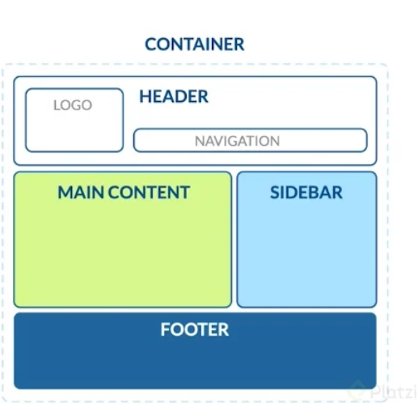

# Anatomía de una página web
**HTML** es el lenguaje utilizado para dar estructura a la página web, significa **"HyperText Markup Lenguaje"**

## Estructura básicade HTML en una página web
* Container: contenedor principal
* Header: cabecera de la página. Aquí usualmente encuentras el logo y el menú de navegación del sitio.
* Main content: estructura principal. Por ejemplo, el feed o lista de publicaciones de una red social.
* Sidebar: contenido secundario de una página, que usualmente se encuentra a los lados del contenido principal (o main).
* Footer: pie de página. Esto se encuentra al fondo del sitio web, salvo en casos de sitios web donde el scroll (o navegación hacia abajo) es infinito, por ende, no tendría sentido ponerlo al fondo.

Las etiquetas en HTML nos ayudan a diferenciar en qué parte del contenido nos encontramos.

La web se conforma de tres conceptos:
* URL: Uniform Resource Locator. El identificador único del sitio en el navegador (por ejemplo: https://platzi.com).
* HTTP: Protocolo de transferencia de hipertexto. Es el estándar que se utiliza para enviar datos a través de paquetes entre el cliente y el servidor.
* HTML: es el código que se emplea para estructurar el contenido de tu web, y darle sentido y propósito.