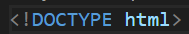
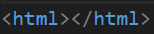
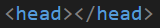
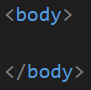

# Index y su estructura básica: head
Para explicar la estructura de un archivo *index.html*, se armó el [siguiente archivo](https://github.com/CarlosGiles/DesarrolloWeb/blob/main/Curso%20HTML%20y%20CSS/7.1index.html).

Un archivo **index.html** (puede llamarse de otro modo pero se usa ese nombre como estándar) es el archivo que corresponde a la página inicial que el servidor debe buscar para abrir un proyecto. Sin esta página (index.html) deberíamos entonces especificar al servidor cuál es la página que debe cargar como principal.

La primer linea de código es la etiqueta que indica al navegador el tipo de documento que está cargando, es decir, **HTML**: 
* se escribe

* Enseguida es declara un contenedor principal cuya etiqueta (como todas las demás) se compone de una parte que abre y una que cierra

Dentro de la etiqueta que abre de **html** podemos agregar el atributo **lang="es"** para indicar al navegador en qué idioma está.

* La siguiente etiqueta que abre y cierra es para el contenedor **head**, cuyo padre es la etiqueta **html** y tendrá al hermano **body**

Esta etiqueta contendrá todo lo que es importante para que el navegador cargue el proyecto pero que no es visual para el usuario, por ejemplo, contendrá las fuentes y los CSS. Algunas etiquetas deentro de este contenedor se conocen como **"etiquetas meta"**.

* La etuiqueta **body** contendrá todo lo que es visual para el usuario

## Etiquetas del body

* article: diferencia partes del contenido que pueden vivir por sí mismas.
* nav: para hacer menús de navegación.
* aside: contenido menos relevante, como publicidad, etc.
* section: sirve para diferenciar las secciones principales del contenido.
* header: cabecera del documento.
* footer: pie de página del documento.
* h1 - h6: títulos de nuestro sitio web.
* table: tablas de contenidos, similar a la estructura de las hojas de calculo.
* ul y ol: listas de items.
* div: cualquier división para organizar el contenido.
* h1 a h6: son etiquetas para indicar títulos con un estilo que destaca del resto.
* article: es la parte de nuestro contenido que puede vivir por sí mismo. Pueden haber tantos artícle como proyectos o eventos tenga nuestro portafolio.
* p: define el texto de un párrafo.
* small: aplica una apariencia de texto reducido en tamaño.
* strong: aplica al texto un formato de negritas.
* a: corresponde a un ancla o enlace a una url interna o externa del documento.
* img: con esta etiqueta podemos enlazar imágenes en el documento.
* figure: le da un contexto semántico a las imágenes.
